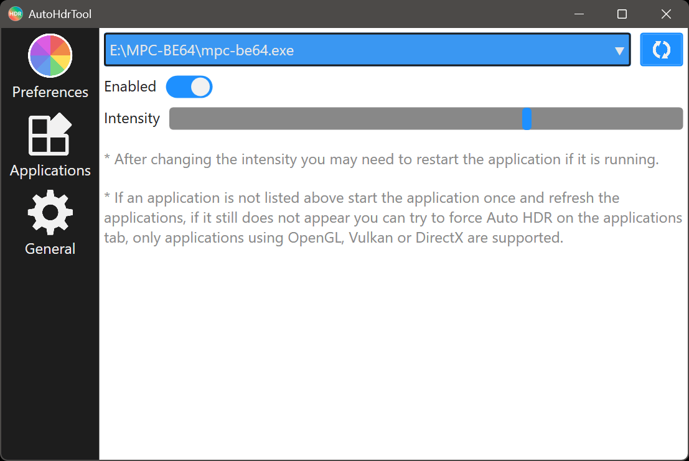
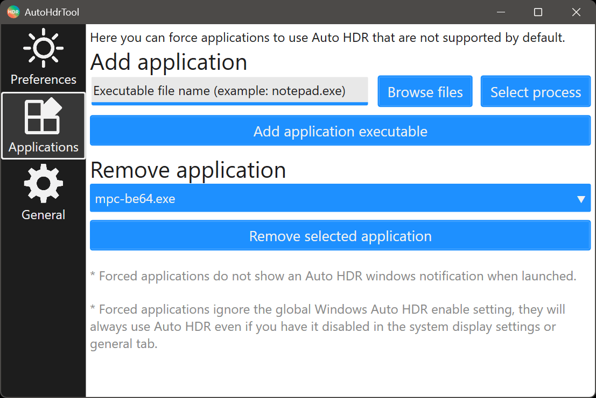

## Application description
Change Windows Auto HDR settings without Xbox Game Bar and allow unsupported applications to use Auto HDR.

## Installation Instructions
1) Extract the AutoHdrTool folder to any directory you want on your device.
2) Run the AutoHdrTool executable file to launch the application.

## Requirements
- Microsoft .NET Runtime installed.
- Microsoft Windows 11 64-bit or higher is required.

## Known Issues
You can find all known issues at https://issues.arnoldvink.com/?p=AutoHdrTool

## Support and bug reporting
When you are walking into any problems or a bug you can go to my help page at https://help.arnoldvink.com so I can try to help you out and get everything working.

## Developer donation
If you appreciate this project and want to support me with my projects you can make a donation through https://donation.arnoldvink.com

## Changelog
v1.0.0.0 (25-January-2026)
- First public test release.